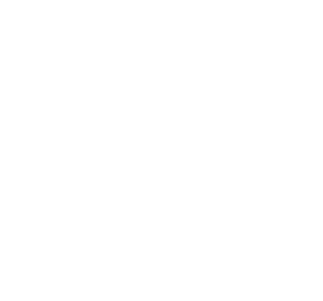
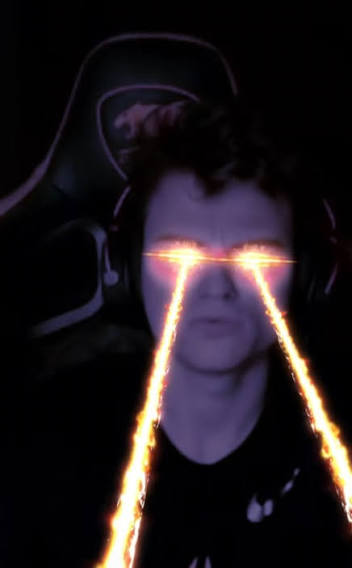

# WEB DEVELOPMENT PROJECT REPORT

**Student:** Tamerlan  
**Group:** IT-2510  
**Project:** DOTA 2 — THE UNOFFICIAL HISTORY  
**Live URL:** https://tamerlanaitpayev1-netizen.github.io/Web/  
**Repository:** https://github.com/tamerlanaitpayev1-netizen/Web

---

## 1. Project Overview

The project is a multi-page website called **“DOTA 2 — THE UNOFFICIAL HISTORY”**.

The website presents Dota 2 memes, streamer moments and community culture in the style of a historical archive. The design intentionally combines a serious archive/document style with humorous Dota 2 content.

The project contains three main pages:

- **Home** — `index.html`
- **Meme Archive** — `about.html`
- **Report / Case File** — `contact.html`

The website was developed using HTML5 and CSS3. Local images and video files are used as part of the website content.



---

## 2. Task 1 — Project Setup and Home Page

### Project structure

```text
Web/
├── index.html
├── about.html
├── contact.html
├── REPORT.md
├── css/
│   └── style.css
├── images/
│   └── ...
└── media/
    └── Dota 2 video files
```

All HTML pages use a valid HTML5 document structure with:

- `<!DOCTYPE html>`
- `lang` attribute;
- UTF-8 character encoding;
- viewport meta tag.

The home page contains a header, navigation, main content and footer.

The page has one main `h1` heading and several `h2` headings. It also contains original project text, unordered and ordered lists, and images from the `images` folder.

The navigation links connect the three pages of the project.

### Home page visual evidence

The website uses a black, white and red archive-style visual design.


---

## 3. Task 2 — About Page, Media and Navigation

The **Meme Archive** page is dedicated to documented Dota 2 memes.

The page contains an introduction describing the main topic. One of the main examples is the **“12 Tango”** meme.

The project uses the article **“Двенадцать танго! — Легендарные мемы в Dota 2”** from Игромания as a source for the documented meme material.

The page contains an ordered timeline with dates and an unordered list with facts about the archive.

### Figure and caption

The page uses the `figure` element with an image, meaningful `alt` text and `figcaption`.

### Blockquote

A `blockquote` element is used to demonstrate semantic HTML and to present a source-based statement.

### Text formatting

The project uses semantic text formatting with:

- `strong`
- `em`

### Media

The archive contains local Dota 2 video files. Examples include:

- 12 Tango;
- Первый скилл и третий;
- Шаманчик, связывай;
- Пудж, оставь реген;
- Баунтихантер, приди к нам;
- Толик, легенда.

The page also contains an external source link using `target="_blank"` and `rel="noopener"`.

The same navigation is used on all pages, and the active page is visually indicated.

### Archive visual evidence




The **Old God** entry is intentionally presented as a separate meme/character and is not identified as Papich.

---

## 4. Task 3 — Table and Form

### Data table

The archive page contains a table with real source-based meme data.

The table includes:

- meme name;
- source/person;
- description;
- category.

The table uses:

- `caption`;
- `thead`;
- `tbody`;
- `tfoot`;
- `th scope`;
- `rowspan`;
- `colspan`.

This demonstrates both semantic table structure and more advanced table formatting.

### Form

The **Report / Case File** page contains a form inside a `fieldset` with a `legend`.

The form demonstrates more than five input types, including:

- text;
- number;
- date;
- email;
- radio;
- checkbox;
- select;
- textarea;
- submit button.

All labels are connected to their inputs using matching `for` and `id` attributes.

The form also uses native browser validation:

- `required`;
- `minlength`;
- `maxlength`;
- `min`;
- `max`;
- `step`;
- `type="email"`.

Radio buttons use the same `name` attribute so that only one option can be selected.

---

## 5. Task 4 — CSS

All pages use one external stylesheet:

`css/style.css`

No separate inline stylesheet is required.

### Colors

The main visual palette consists of black, white and red, with a dark line color used for borders.

The stylesheet demonstrates different color formats:

- HEX;
- RGB;
- HSL;
- named color.

Examples include:

```css
#050505
rgb(215, 25, 32)
hsl(0 0% 16%)
white
```

### Fonts

The project uses two main font families:

- Arial / Helvetica for normal text;
- Georgia / Times for headings.

### Box model

The stylesheet demonstrates the CSS box model using:

- `margin`;
- `padding`;
- `border`.

### CSS selectors

The project demonstrates:

- element selectors;
- class selectors;
- ID selectors.

### Navigation

The navigation is styled consistently on every page. Hover states change more than just the text color and the active page is visually marked.

### Form focus

Form inputs have visible focus styling so the currently selected control can be identified.

### CSS units

The project uses several CSS units required by the assignment:

**px** — used for precise borders, gaps and other fixed-size values.

**%** — used for responsive widths and layout dimensions.

**rem** — used for scalable spacing and typography.

**em** — used for relative text sizing.

**vh** — used for viewport-based hero section height.

For example:

```css
#hero {
    min-height: 82vh;
}
```

CSS Grid is also used to organize archive cards and other sections of the website.

---

## 6. Task 5 — Validation and Publishing

The project is stored in the GitHub repository:

**tamerlanaitpayev1-netizen/Web**

The website is published using GitHub Pages.

### Live website

https://tamerlanaitpayev1-netizen.github.io/Web/

The three pages were tested as a connected website with the same navigation structure.

The final submission should also include screenshots of the W3C HTML and CSS validation results after validation is performed.

### Published website

[Open the live website](https://tamerlanaitpayev1-netizen.github.io/Web/)

---

## 7. Screenshots and Visual Evidence

### Home page

The home page uses the archive concept and introduces the project.


### Meme Archive

The archive page contains documented meme material, images, a timeline, facts, videos and a data table.


### Old God section


### Papich section


### Report page

The Report page contains the HTML form required by the assignment.

The form can be viewed on the live website:

[Open Report page](https://tamerlanaitpayev1-netizen.github.io/Web/contact.html)

### Validation screenshots

The W3C HTML and CSS validator screenshots should be added here after validation.

- HTML validation screenshot: **to be added after final W3C check**
- CSS validation screenshot: **to be added after final W3C check**

---

## 8. Defense — Code Explanation

HTML is responsible for the structure and content of the website.

Semantic elements such as `header`, `nav`, `main`, `section` and `footer` divide the page into meaningful parts.

CSS controls the appearance of the website. The external stylesheet allows all pages to share the same visual design.

CSS Grid is used to create layouts for archive cards and other content sections.

The `video` element is used to display local MP4 files.

The table organizes structured information using `thead`, `tbody`, `tfoot`, `th`, `rowspan` and `colspan`.

The form demonstrates HTML input types and native browser validation.

During the defense, one small change can be demonstrated by changing a CSS property such as the color, spacing or font size and observing the result in the browser.

---

## 9. Conclusion

This project demonstrates the basic principles of creating a multi-page website using HTML5 and CSS3.

The website includes semantic HTML, navigation, lists, images, figure and figcaption, blockquote, video, a data table and a validated form.

The main concept is to present Dota 2 meme culture as a fictional historical archive. This allowed the required technical elements to be integrated into an original website concept.

The project was published using GitHub Pages.

**Student:** Tamerlan  
**Group:** IT-2510

**Live URL:** https://tamerlanaitpayev1-netizen.github.io/Web/

---

## Source

The meme archive material is based on the following source:

**Игромания — “Двенадцать танго! — Легендарные мемы в Dota 2”**

The source is used for reference and the descriptions on the website are paraphrased rather than copied as a full article.
